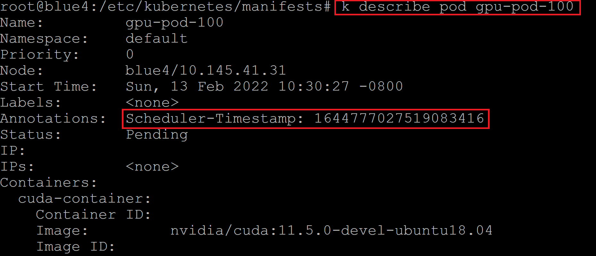

# How to customize Kubernetes scheduler 

Using kubernetes schedulering framework, build an out-of-tree scheduler to replace the default kuber-scheduler, based on [Kubernetes SIG scheduler-plugins](https://github.com/kubernetes-sigs/scheduler-plugins)

## Steps


## Catches
1. The ```go.mod``` file, scheduler-plugins depends on kubernetes, but ```go mod tidy``` will include kubernetes's staging dependencys, which have version 0.0.0. Needs to replace manually. or just use the go.mod file from "sigs.k8s.io/scheduler-plugins/"
2. The kube-scheduler deploy yaml file is located at [```/etc/kubernetes/manifests/kube-scheduler.yaml```](https://github.com/Fizzbb/KubernetesNotes/blob/master/scheduler-plugin/manifests/kube-scheduler.yaml), Kubernetes check it on the background, any changes in that file will cause scheduler pod re-deployed. If syntax error or unsupported configs are added in the yaml file, the kube-scheduler will disappear, util a valid yaml is updated. So always backup the default yaml before changes.
3. For the ```/etc/kubernetes/manifests/kube-scheduler.yaml```, don't load the scheduler [config file](https://github.com/Fizzbb/KubernetesNotes/blob/master/scheduler-plugin/manifests/alnair-scheduler-config.yaml) (```--config=XXX.yaml```) with configMap. Use hostPath file mount. Although an all-in-one yaml can be created using configMap, but the configuration cannot pass through this way. The guess is that only file changes are tracked by Kuberenets not the configMap object.
4. Use ```kube-scheduler``` command arguments ```--v=5``` or some other values to see the debug logs. Corresponding in the code write ```klog.V(5).InfoS("")```
5. If connect to Kubernetes.Clientset, the rest.InClusterConfig() will not work like regular pods (because the ```/var/run/secrets/kubernetes.io/serviceaccount``` will not automatically mount to kube-scheduler pod), so we have to choose clientcmd.BuildfromFlags
6. Following the No. 5, you cannot just add a flag/arguments, in the PluginConfig in the KubeSchedulerConfiguration, the Args changes, need to be defined in "sigs.k8s.io/scheduler-plugins/apis", or your own versions of apis, to solve this temporaily. we can use a fixed path setting, ```clientcmd.BuildConfigFromFlags("", "/etc/kubernetes/scheduler.conf")```
7. After connected to Kubernetes.Clientset, if you want to update/patch pods, you need to update RBAC of user ```system:kube-scheduler```, by default kube-scheduler does not have the privilge to update pods. Refer to this [rbca](https://github.com/Fizzbb/KubernetesNotes/blob/master/scheduler-plugin/manifests/extra-rbac-kube-scheduler.yaml) file. In addition, you need to apply this as a seperate file, don't just attach to the end of kube-scheduler.yaml. It won't work. Verify the rights by ```kubectl auth can-i update pods --as system:kube-scheduler```. 
8. Now you should be able to patch pods, however, don't use ```newPod := oldPod.DeepCopy()``` this kind of way. Because it will copy all the info, includes object version. When you patch it, error is ```err: Operation cannot be fulfilled on pods "XXX": the object has been modified; please apply your changes to the latest version and try again```, just create the patch data ```patchData := map[string]interface{}{"metadata": map[string]map[string]string{"annotations": {
		"Scheduler-Timestamp": fmt.Sprintf("%d", time.Now().UnixNano())}}}```
9.  After adding the config file in the ```kube-scheduler --config=XXX``` command, in the config file, profiles sections, if the scheduler name is not ```default-scheduler```, you need to add scheduler name in the pods/deployments/... spec, if even there is only one profile in the file.
10. Last but not the least, if you modify the score plugin, to test the functions, you need to choose at least a two worker node cluster, or untaint the master (```kubectl taint node <MASTER_NODENAME> node-role.kubernetes.io/master:NoSchedule-```). Otherwise the score phase will not be invoked in a one-node cluster. Furthermore, if the test pod requires special resources e.g. GPU, after filter, only one GPU node left, the score plugin won't be invoked either.
11. One more thing is in the main.go file, we need to ```import _ "sigs.k8s.io/scheduler-plugins/pkg/apis/config/scheme"```. Refer to [line 38](https://github.com/kubernetes-sigs/scheduler-plugins/blob/master/cmd/scheduler/main.go). This is for registering the ```KubeSchedulerConfiguration``` kind, used in the configuration file. Otherwise during runtime it will complain no this kind registered to runtime scheme. In addition, if you want to add extra arguments for the plugin in the configuration file, this apis scheme needs updates accordingly.

# Results
After addressing all the issues above, you can see pods all come with a nano second resolution timestamp (the time it enters scheduler's scoring phase) in the annoations after scheduling.


